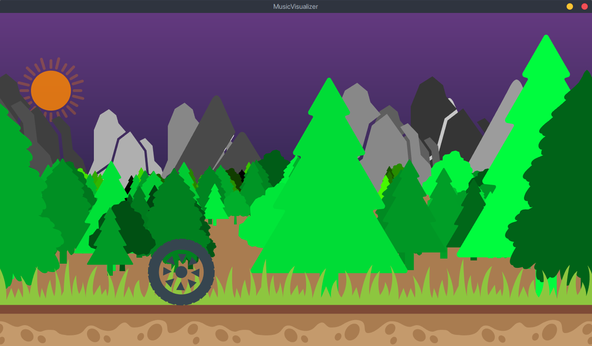

# Final project for "Generative Gestaltung"
**at Beuth University of Applied Sciences Berlin**

A scalable side-scroller that interacts with music.

# Resources
This project uses several shapes by third-party artists under CC. Big shout outs to the artists below.

## Radial Tyre
Radial Tyre by Souvik Bhattacharjee from the Noun Project  
https://thenounproject.com/term/radial-tyre/878236/

## Trees
Tree by Tjaša Kimovec from the Noun Project  
https://thenounproject.com/term/tree/1088718/

Tree by Edward Boatman from the Noun Project  
https://thenounproject.com/term/tree/173/

Tree by Tin Phatanapirom from the Noun Project  
https://thenounproject.com/term/tree/10225/

## Mountains
Mountain by iconcheese from the Noun Project  
https://thenounproject.com/term/mountain/1639115

Mountain by iconcheese from the Noun Project
https://thenounproject.com/icon.cheese/uploads/?i=1639116

## Sun
Sorry, I've lost track where I git this shape from. It's likely from the Noun Project's website. If you happen to see your work here and want proper attribution per license requirements, please message me.

## Ground
"Designed by Freepik"  
https://www.freepik.com/free-vector/ground-and-grass-birders-pack_1096843.htm#term=ground&page=1&position=0
